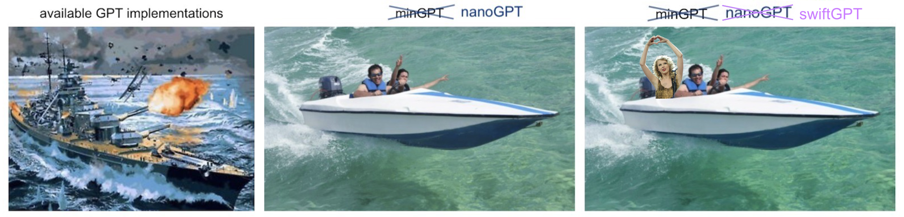

# swiftGPT



This repository is a fork of Andrej Karpathy's [nanoGPT](https://github.com/karpathy/nanoGPT) trained on Taylor Swift lyrics. It's purpose is to get myself familiar with the building blocks of GPTs. Two of the models (nanoGPT) are trained from scratch while the others are finetuned versions of GPT-2.

## overview

|model|swiftGPT-nano-stoi|swiftGPT-nano-bpe|swiftGPT-2-f|swiftGPT-2-LoRA|swiftGPT-2-SP|
|----|----|----|----|----|----|
|characteristics|character-level nanoGPT|nanoGPT using the OpenAI BPE tokenizer|GPT-2 finetuned|GPT-2 finetuned using Low-Rank Adaptation (LoRA)|GPT-2 finetuned using Soft Prompts|
|number of parameters|10.65M|29.94M|123.65M|tbd|tbd|
|layers|6|6|12|
|heads|6|6|12|
|embedding size|384|384|768|
|block size|256|256|1024|
|vocab size|80|50304|50304|
|tokenizer|string to index|BPE|BPE|
|training data|txt file containing all of TS lyrics|txt file containing all of TS lyrics|txt file containing all of TS lyrics|

## install

```
pip install torch numpy transformers tiktoken wandb tqdm
```

Dependencies:

- [pytorch](https://pytorch.org)
- [numpy](https://numpy.org/install/)
-  `transformers` for huggingface transformers (to load GPT-2 checkpoints)
-  `tiktoken` for OpenAI's fast BPE code
-  `wandb` for optional logging
-  `tqdm` for progress bars

## quick start

Training a character-level GPT on the works of Taylor Swift. First, we download all of Taylor Swift's lyrics in a single (0.3MB) file and turn it from raw text into one large stream of integers:

```
python data/swift_char/prepare.py
```

This creates a `train.bin` and `val.bin` in that data directory. Now it is time to train the GPT. The size of it very much depends on the computational resources of your system:

**I have a Mac**: 
The default GPT has a context size of up to 256 characters, 384 feature channels, and it is a 6-layer Transformer with 6 heads in each layer. On a M1 MacBook Pro the training takes about 10 min and the best validation loss is 1.5685. For longer training times the validation loss increases while the training loss decreases, indicating overfitting.

```
python train.py config/train_swift_char.py --device=mps --compile=False --max_iters=500
```

A simpler train run could look as follows, taking around 25 sec.

```
python train.py config/train_swift_char.py --device=mps --compile=False --eval_iters=20 --log_interval=1 --block_size=64 --batch_size=12 --n_layer=4 --n_head=4 --n_embd=128 --max_iters=500 --lr_decay_iters=2000 --dropout=0.0
```

To gernerate an output, use:

```
python sample.py --out_dir=out-swift-char --device=mps
```

The model generates samples like this:

```
And I don't fen heart a hagn stroe
I bet you want to go

'Cause I know it care yoeher here

[Chorus]
It's just just wasn't know what yoe wasn't mething
We don't know we grow up uperfactly writt of twing?
I see back togs plane somethink to fly, start sneak what it to secome back to me?

And me come back to New Yorh YorKeep to me deep crawere like does
And I can got a back to time all new
Let you spicting to December throom and tearler

Now I could be tell be ol yoah
Welcome bright wearing so to N
```

Note: In case you don't use a Apple Silicon Mac, you have to set `--device=cpu`.


**I have a GPU**: 
In case you have a GPU, you can simply train the model with:

```
$ python train.py config/train_swift_char.py
```

And generate outputs by:

```
$ python sample.py --out_dir=out-swift-char
```

In order to train the different models from the table above, you can adjust the training as follows. Instead of `config/train_swift_char.py`, use `config/train_swift.py` to train **swiftGPT-nano-bpe** and `config/finetune_swift.py` to tain **swiftGPT-2-f**. 
To generate outputs you have to change `--out_dir=out-swift-char` to `--out_dir=out-swift` for both, **swiftGPT-nano-bpe** and **swiftGPT-2-f**.

## example outputs

**swiftGPT-nano-stoi**:
```
And I don't fen heart a hagn stroe
I bet you want to go

'Cause I know it care yoeher here

[Chorus]
It's just just wasn't know what yoe wasn't mething
We don't know we grow up uperfactly writt of twing?
I see back togs plane somethink to fly, start sneak what it to secome back to me?

And me come back to New Yorh YorKeep to me deep crawere like does
And I can got a back to time all new
Let you spicting to December throom and tearler

Now I could be tell be ol yoah
Welcome bright wearing so to N
```

**swiftGPT-nano-bpe**:
```
And I'm dancing
'Cause I feel so sweet sorrow
You weren't take one of a deep breath out about him
And Im not what a new soundtrack
When we're not not out of starlight
But I just a new romantics
And I want is you never let me
'Cause I kinda record that's watching to New York

Say that way
You and our heart so much

So I wished on a daydream

Uh baby, you would be a small town
I wished on a crowded game
Oh, I am not so the same old little while you're doing afraid to ask me with a mess
It was screaming and daddy's just for pictures just for a ruthless game
It's been a state of line
And I'm spinning around
```

**swiftGPT-2-f**:
```
And these days I will be able to write:

My lips are like a man that sleeps on a couch,
For he that is tired has a pillow of pillow;
And when he is tired he will look down while
The word is spoken on him, and he will hear it,
Because this word is not present in the world,
But the very thing it speaks is the very thing itself.
```


## todos

- Try parameter efficient fine tuning methods and compare results

##

Note: The original Readme can be seen [here](https://github.com/karpathy/nanoGPT/blob/master/README.md)